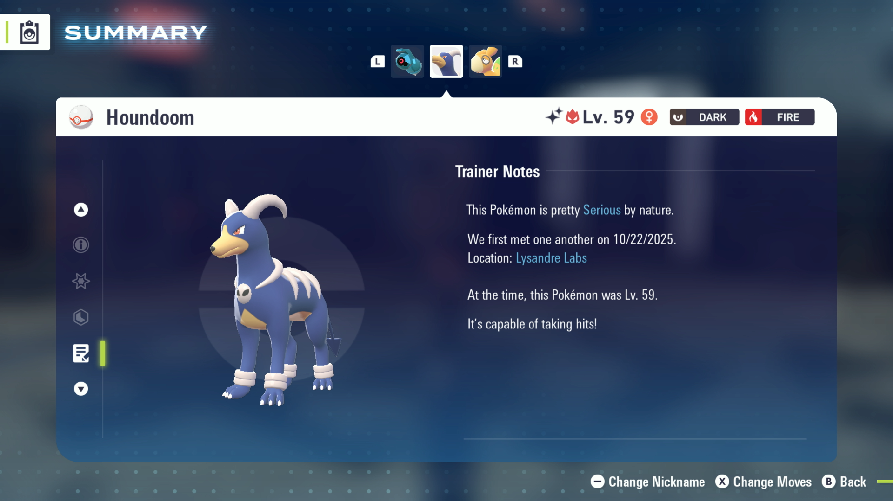

# Shiny Hunt - Beldum

## Program Description

Repeatedly enter Lysandre Labs to shiny hunt Beldum.

This program requires audio recognition to detect shinies.

In addition to Bedlum/Metang, shinies along the path will also be detected.

This list of Pokémon this program can shiny hunt are:

- Beldum
- Metang
- Noivern
- Houndour
- Houndoom

<iframe width="560" height="315" src="https://www.youtube.com/embed/DoPM13YwZrw?si=AFjXr4FnvKqAuARD" title="YouTube video player" frameborder="0" allow="accelerometer; autoplay; clipboard-write; encrypted-media; gyroscope; picture-in-picture; web-share" referrerpolicy="strict-origin-when-cross-origin" allowfullscreen></iframe>

_The not-a-Beldum found in the video above._

## Settings

**Switch Settings:**

1. Screen size: Must be 100% within the Switch settings
2. [The profile you are using must be the 1st (left-most) profile.](../NintendoSwitch/Switch2Notes.md#resetting-a-game-moves-the-cursor-to-the-1st-user-profile)

**Program Settings:**

1. Audio input is set to the correct source.

**Game Settings:**

1. Text Speed: Fast

## Instructions

1. In Lysandre Cafe, face the entrance to Lysandre Labs.
2. Start the program in-game.

The program will enter the labs and run toward the Beldum room. If it detects any shiny, it will go to Switch home.

## Options

### Take Video:

Take a video when shiny detected.

### Go Home when Done:

Go to the Switch Home to idle when finished.

## Credits

- **Author:** kichithewolf

**Discord Server:** 

