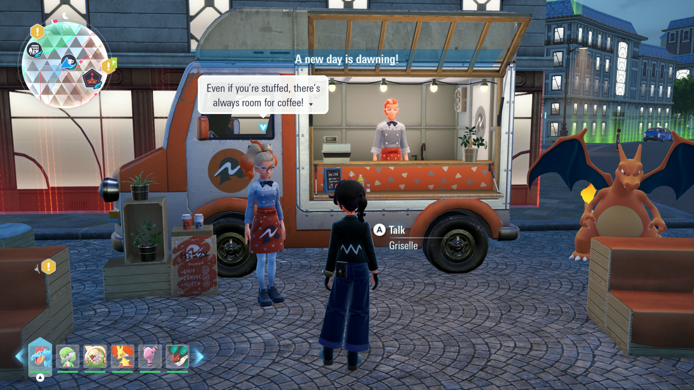

# Cafe Buyer

## Program Description

Repeatedly use Cafes to obtain the Cafe Regular title and raise friendship.

## Settings

**Game Settings:**

1. Text Speed: Fast

## Instructions

1. Fly to Nouveau Cafe (No. 1) and stand in front of Griselle.
2. Start the program in-game.

The program will buy Fresh Water from Nouveau Cafe, as it is the cheapest option ($100) across all cafes. Cafe No. 1 is required as it has the "previous purchase" option.

Make sure you have enough money, the program will not detect when you are out of cash. It will error out if you run out of money.

This program can handle the day/night change.

For raising friendship, use [Friendship Farmer](FriendshipFarmer.md) instead. However, if using this program to raise friendship (+30 each time), please note that each purchase will only affect your active Pokemon. If using to evolve Eevee, make sure to change the day/night cycle afterwards, as the evolution prompt will not appear until the next change.

## Options

### Purchases:

The number of times to purchase Fresh Water.

### Go Home when Done:

Go to the Switch Home to idle when finished.

## Credits

- **Author:** kichithewolf

**Discord Server:** 

