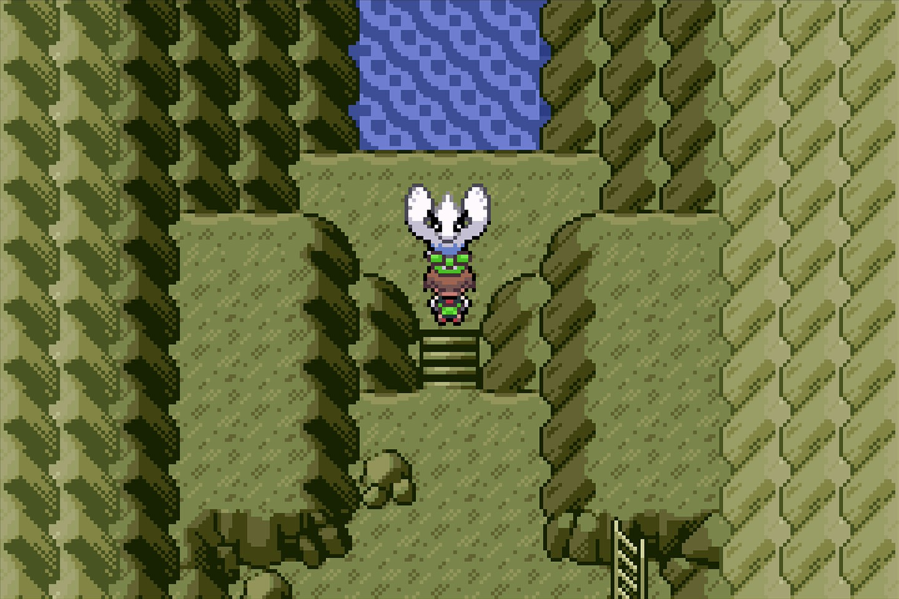
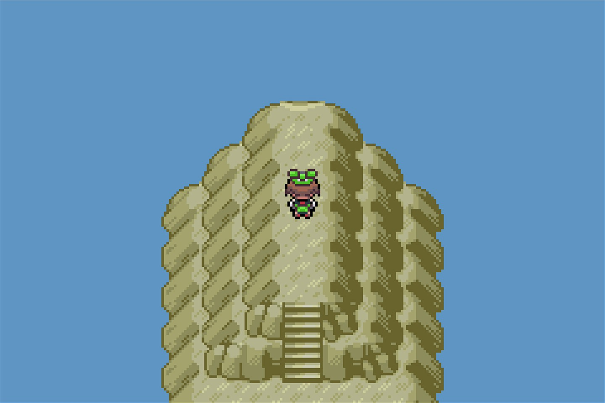
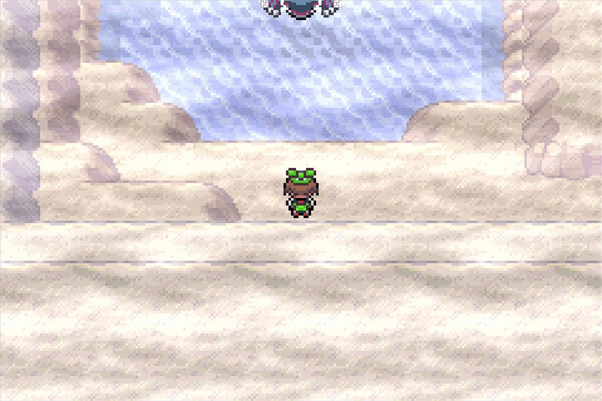
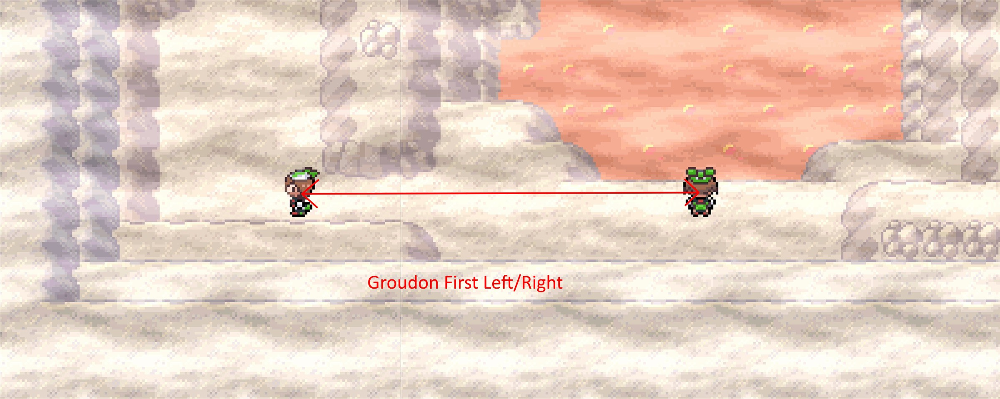
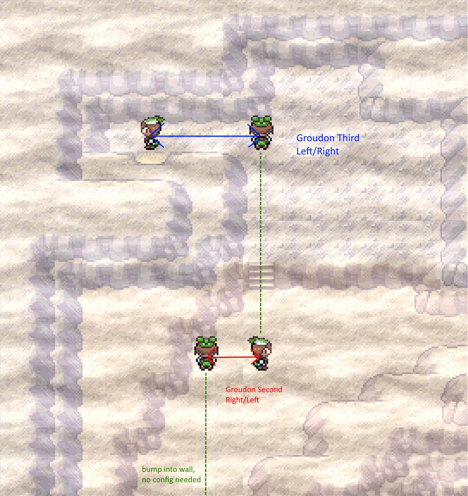
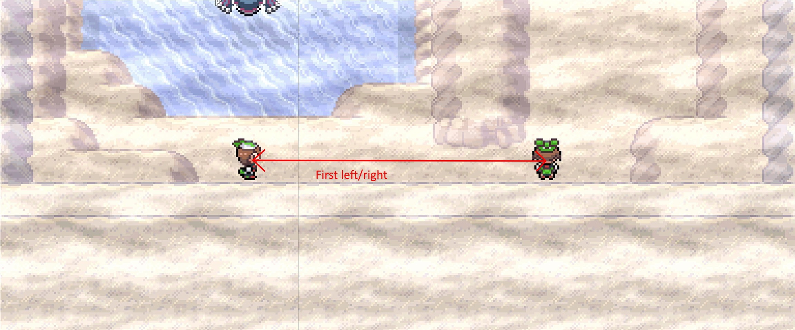
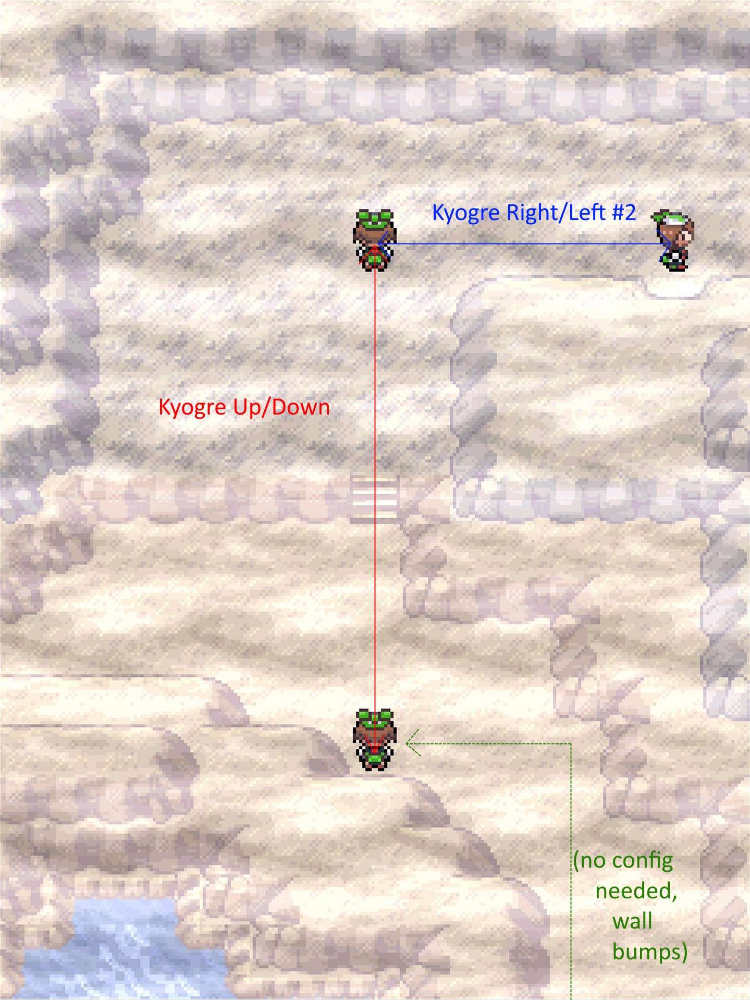
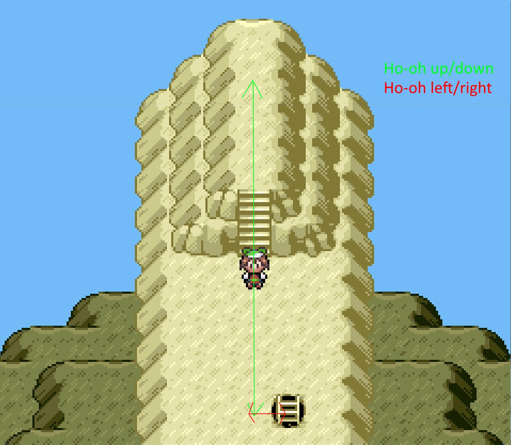
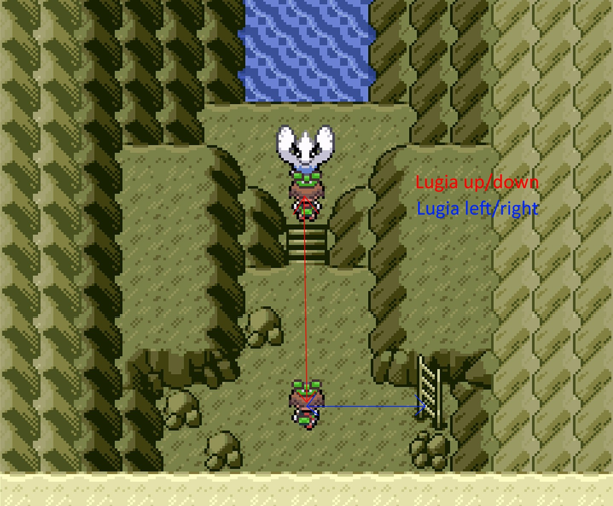

# Legendary Run Away (Emerald)

## Program Description

Use the Run Away method to shiny hunt legendaries in Emerald.

This program works for:

* Regirock, Regice, Registeel
* Groudon
* Kyogre
* Ho-Oh
* Lugia

## Setup

**Switch Settings:**

1. Screen size: Must be 100% within the Switch settings
2. [Switch 2: All HDR options must be disabled.](../NintendoSwitch/Switch2Notes.md#switch-2-hdr-may-be-problematic)

**Program Settings:**

1. Video Resolution: 1080p or higher

**Game Settings:**

1. Text Speed: Fast
2. Battle Scene: Off
3. Frame: Type 1
4. Button Mode: **NOT** L=A

**Other Setup:**

1. Your lead Pokemon must be able to run away successfully, or must have a Smoke Ball.
2. (Optional) For faster resets, your lead does not have any abilities that activate on entry.
3. There are no effects that would interrupt movement. (Repels, Eggs hatching, etc.)

## Instructions

1. Stand in front of your target.
    - For Ho-Oh, Groudon, and Kyogre, stand one tile before your target. (See below. Stand in that exact position facing the legend for Groudon/Kyogre.)
2. Start the program in game.

 

## Notes

If you stop the program and switch off or soft reset your game, try to vary the amount of time you wait before starting the program again. This is due to Emerald's broken RNG.

## Options

### Target:

The legendary Pokemon you are hunting.

For Deoxys, see [Shiny Hunt - Deoxys](ShinyHuntDeoxys.md).

For Mew, see [Shiny Hunt - Mew](ShinyHuntMew.md).

### Movement configuration options:

You should not need to touch of these options below.

- Groudon first left/right time: Time it takes to turn and run 10 steps left/right after/before the encounter.

- Groudon second right/left time: Time it takes to turn and run 2 steps right/left after/before the encounter.

- Groudon third left/right time: Time it takes to turn and run 4 steps left/right after/before the encounter.

- Kyogre first left/right time: Time it takes to turn and run 9 steps right/left after/before the encounter.

- Kyogre up/down time: Time it takes to turn and run 10 steps up/down after/before the encounter.

- Kyogre second left/right time: Time it takes to turn and run 6 steps right/left after/before the encounter.

- Ho-Oh up/down time: Time it takes to run up to Ho-Oh or down away to reset.

- Ho-Oh left/right time: Time it takes when facing the same direction to take one step left or right.

- Lugia up/down time: Time it takes to run up to Lugia or down away to reset.

- Lugia left time: Time it takes walk three steps left after entering Lugia's room.

Click to expand for images

Groudon:

Video of path: https://youtu.be/dCX6NFzwxeE

Kyogre:

Video of path: https://youtu.be/y9CxPUkFuBE

Ho-Oh:

Lugia:

## Credits

- **Author:** kichithewolf

**Discord Server:** 

